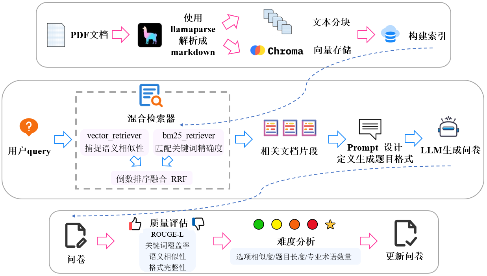

# DocuQuiz-RAG
基于RAG技术的智能文档题目生成与评估系统



一个端到端的RAG管道，使用LlamaIndex和混合搜索技术，从密集的技术文档中自动生成、评估和分析题目难度。

## 📋 项目概述

DocuQuiz-RAG是一个基于RAG（检索增强生成）技术的智能文档题目生成系统，专门为中文通信技术文档设计。系统能够自动解析PDF文档，生成高质量的选择题，并对生成题目进行多维度质量评估和难度分析。

## 🏗️ 系统架构


## 📁 项目结构

```
DocuQuiz-RAG/
├── data/                           # 数据目录
│   └── 语义通信白皮书.pdf          # 示例PDF文档
├── docs/                           # 文档目录
│   └── architecture.png            # 系统架构图
├── notebooks/                      # Jupyter notebook（开发用）
│   └── auto.ipynb                 # 原始开发代码
├── output/                         # 输出目录
│   └── survey.md                  # 生成的问卷示例
├── src/                            # 源代码目录
│   ├── __init__.py                 # 包初始化
│   ├── main.py                     # 主程序入口
│   ├── config.py                   # 环境配置模块
│   ├── llm.py                      # LLM集成模块
│   ├── document_processor.py       # 文档处理模块
│   ├── quiz_generator.py           # 题目生成模块
│   ├── evaluator.py                # 质量评估模块
│   ├── difficulty_analyzer.py      # 难度分析模块
│   ├── requirements.txt            # 依赖包列表
│   └── README.md                   # 源码说明文档
├── LICENSE                         # 开源许可证
└── README.md                       # 项目说明文档
```

## 🚀 核心功能

### 🔧 环境配置与模型初始化
- **HuggingFace集成**：自动配置镜像地址和模型缓存
- **嵌入模型**：使用BAAI/bge-m3进行中文文本向量化
- **GPU支持**：自动检测并使用GPU加速

### 📄 文档处理与向量化
- **PDF解析**：基于LlamaParse的高质量中文PDF解析
- **智能分块**：保留元数据和上下文关系的文本分块
- **混合检索**：向量检索 + BM25检索，RRF融合算法
- **持久化存储**：Chroma向量数据库，支持增量更新

### 🎯 智能题目生成
- **基于检索的生成**：根据查询检索最相关文档片段
- **高质量输出**：标准化的选择题格式，包含答案和出处
- **批量生成**：支持多主题批量题目生成
- **质量控制**：自动格式验证和错误重试机制

### 📊 多维度质量评估
- **ROUGE-L评分**：文本重叠度分析（权重30%）
- **关键词覆盖率**：基于jieba分词的关键词匹配（权重30%）
- **语义相似度**：TF-IDF向量化相似度计算（权重30%）
- **格式完整性**：题目格式标准检查（权重10%）
- **综合评级**：≥0.6分为合格，提供详细评分报告

### 🎯 智能难度分析
- **选项相似度分析**：计算选项间语义相似度
- **专业术语识别**：内置20+通信领域术语词典
- **复杂度特征**：题目长度、术语密度等指标
- **5星级评级**：🟢简单(1星) → ⭐挑战(5星)
- **统计报告**：难度分布统计和详细分析

## 🛠️ 技术栈

- **核心框架**：LlamaIndex, PyTorch
- **文档解析**：LlamaParse, PyMuPDF
- **向量数据库**：ChromaDB
- **嵌入模型**：BAAI/bge-m3, SentenceTransformers
- **检索算法**：BM25, RRF融合
- **大语言模型**：DeepSeek API
- **评估工具**：ROUGE, scikit-learn, jieba
- **数据处理**：pandas, numpy

## 📦 安装部署

### 环境要求
- Python 3.8+
- CUDA 11.0+ (GPU推荐)
- 8GB+ 内存

### 安装步骤

1. **克隆项目**
```bash
git clone https://github.com/your-username/DocuQuiz-RAG.git
cd DocuQuiz-RAG
```

2. **创建虚拟环境**
```bash
python -m venv venv
source venv/bin/activate  # Linux/Mac
# 或
venv\Scripts\activate     # Windows
```

3. **安装依赖**
```bash
pip install -r src/requirements.txt
```

4. **配置环境变量**
```bash
export LLAMA_CLOUD_API_KEY="your_llama_api_key"
export DEEPSEEK_API_KEY="your_deepseek_api_key"
export HF_HOME="/path/to/hf_cache"
```

## 🚀 快速开始

### 基本使用

```python
from src import DocuQuizSystem

# 初始化系统
system = DocuQuizSystem(
    llama_api_key="your_llama_api_key",
    deepseek_api_key="your_deepseek_api_key"
)

# 运行完整流程
system.run_full_pipeline(
    pdf_paths=["./data/语义通信白皮书.pdf"],
    queries=["多模态语义通信", "信道编码"],
    output_dir="./output"
)
```

### 分步使用

```python
# 1. 文档处理
system.process_documents(["./data/document.pdf"])

# 2. 设置题目生成器
system.setup_quiz_generator()

# 3. 生成题目
system.generate_quiz(
    query="语义通信",
    num_questions=6,
    output_file="quiz.md"
)

# 4. 质量评估
results = system.evaluate_quiz("quiz.md")

# 5. 难度分析
stats = system.analyze_difficulty("quiz.md")
```

### 命令行使用

```bash
# 基本命令
python src/main.py \
    --pdf_paths ./data/语义通信白皮书.pdf \
    --queries "多模态语义通信" "信道编码" \
    --output_dir ./output

# 高级选项
python src/main.py \
    --pdf_paths ./data/doc1.pdf ./data/doc2.pdf \
    --queries "语义通信" "MIMO技术" "信道编码" \
    --output_dir ./output \
    --force_rebuild \
    --no_evaluate \
    --no_difficulty
```

## 📈 输出结果

系统会生成以下文件：

1. **quiz_*.md** - 生成的题目文件
   - 包含题目、选项、正确答案、出处
   - 难度等级标注（1-5星）

2. **quiz_*_evaluation_report.md** - 质量评估报告
   - 总体统计信息（合格率、平均分）
   - 每道题的详细评分
   - ROUGE-L、关键词覆盖、语义相似度分数

3. **quiz_*_difficulty_report.md** - 难度分析报告
   - 难度分布统计
   - 每道题的难度分析详情
   - 选项相似度、术语密度等指标

## 🎯 系统特点

### ✅ 高精度
- 专业PDF解析，保留格式和元数据
- 混合检索策略，提升检索准确率
- 多维度质量评估确保题目质量

### ✅ 智能化
- 自动难度分析和评级
- 专业术语识别
- 智能错误处理和重试

### ✅ 可扩展
- 模块化设计，易于扩展新功能
- 支持多种文档格式
- 可配置的评估指标

### ✅ 高效
- 向量化缓存，提升处理速度
- 批量处理能力
- GPU加速支持

## ⚙️ 配置参数

主要配置在 `src/config.py` 中：

```python
config = {
    "model_name": "BAAI/bge-m3",              # 嵌入模型
    "vector_store_dir": "./vector_store",     # 向量存储目录
    "document_cache_dir": "./document_cache", # 文档缓存目录
    "hf_endpoint": "https://hf-mirror.com",   # HuggingFace镜像
    "chunk_size": 512,                        # 分块大小
    "similarity_cutoff": 0.7,                 # 相似度阈值
    "vector_weight": 0.6                      # 向量检索权重
}
```

## 🔧 开发指南

### 模块扩展

各模块相对独立，可单独使用：

```python
# 单独使用文档处理
from src.document_processor import DocumentProcessor
processor = DocumentProcessor(llama_api_key="key")

# 单独使用题目生成  
from src.quiz_generator import QuizGenerator
generator = QuizGenerator(retriever=retriever)

# 单独使用质量评估
from src.evaluator import SurveyEvaluator
evaluator = SurveyEvaluator()
```

### 自定义评估指标

```python
# 继承SurveyEvaluator添加新指标
class CustomEvaluator(SurveyEvaluator):
    def evaluate_question(self, question_data, source_text):
        scores = super().evaluate_question(question_data, source_text)
        # 添加自定义指标
        scores['custom_metric'] = self._custom_evaluation(question_data)
        return scores
```

## 📝 注意事项

1. **硬件要求**：建议GPU显存≥8GB
2. **API限制**：确保API密钥有足够额度
3. **首次运行**：需要时间下载模型和构建索引
4. **网络要求**：需要访问HuggingFace和API服务

## 🤝 贡献指南

欢迎提交Issue和Pull Request！

1. Fork项目
2. 创建特性分支 (`git checkout -b feature/AmazingFeature`)
3. 提交更改 (`git commit -m 'Add some AmazingFeature'`)
4. 推送分支 (`git push origin feature/AmazingFeature`)
5. 打开Pull Request

## 📄 许可证

本项目采用MIT许可证 - 查看 [LICENSE](LICENSE) 文件了解详情。

